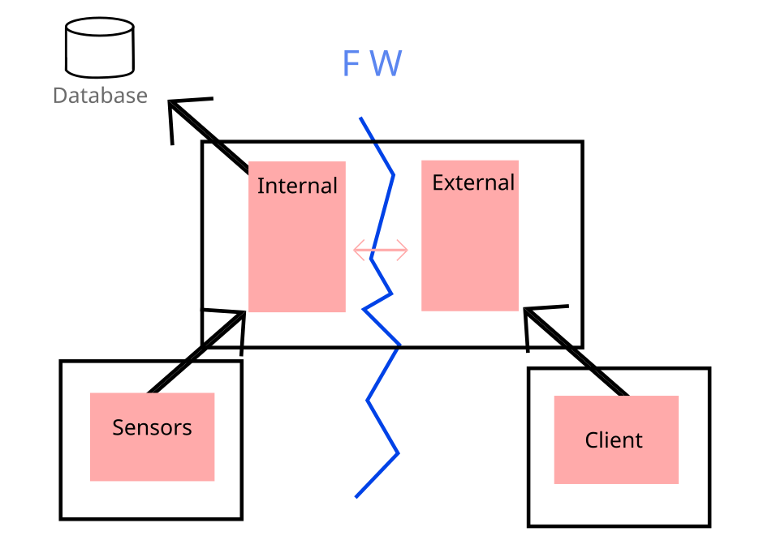

# IoT-PMW: Secure IoT Passthrough Middleware

This project aims to create an IoT Passthrough Middleware (IoT-PMW) that enables secure data transmission through a completely isolated firewall system. By "complete block system," we mean a firewall that fully restricts all network connections, blocking both inbound and outbound traffic. This middleware is designed to operate on a single server, divided into two separate Docker containers. One container is connected to the external network, while the other connects to the internal network, allowing secure, controlled data exchange with specific JSON protocols across the firewall.

## Why IoT-PMW?

The firewall’s role is to protect the network from external threats by blocking all unauthorized connections. So why introduce a middleware solution? The goal is to enable the safe and selective passage of critical data, specifically JSON protocols, between network segments. Using this system, we can monitor and control network data flows, in our case leveraging Go’s SigML package to track and securely transmit sensor data across network boundaries. This approach ensures secure data handling within a firewall-protected environment.

## Technologies Used

The project primarily utilizes the Go programming language and the SigML package to manage errors and streamline JSON protocol handling. Key tools and methods include:

- **Docker Containers**: Two Docker containers separate trusted and untrusted networks, ensuring secure data flow between global and local networks. Each container maintains a secure connection to prevent man-in-the-middle or other security attacks.
  
- **Encryption**: To further enhance security, encryption is implemented for communication between containers. This encrypted connection aims to prevent unauthorized access to sensitive data.
  
- **Database Integration**: The middleware is designed to be compatible with various databases, but PostgreSQL is our chosen solution for this project.

## Program Layout
The main concern for this software will be security. This is part of the reason why it is open source. More eyes on the code will always increase security. The most vulnerable part of the software will be the database. The hard part is parsing the data being passed to the database. Therefore we will carefully parse the data outside of the firewall and keep the database inside the firewall. The internal program will establish an API for the external part of the software. The external part of the software will parse the sigML data to make sure the format is correct. 

### Main Container (internal and external)

The internal program is isolated from the external program while running in the same container. They are both placed on the firewall to allow external communication in accordance to the firewall policy. The internal program can then connect to the internal network. The internal network will consist of the sensors and the admin web interface. The internal and external programs will communicate on a secluded address space with hard-coded symmetrical keys. This makes most man-in-the middle attacks impossible. 

### Sensors
In the above image we have described sensors as a container. This can be done for testing purposes. In reality, this will consist of bases which forward sensor data from one or multiple sensors. 

### Client
The clients would consist of external actors with access to send and fetch senML data. These actors would have to be certified with TLS to ensure security. They will also have to authenticate somehow. 

### Database
The database will contain all the important data. This will be a PostgreSQL database in the final implementation but will be replaced with an SQLite database in the MVP. There are three parts of the database: policy, log and deviceLog. In the policy database we will keep track of users and sensors and their relations. Both credentials and permissions will be kept track, for clients. For sensors, we will keep track of access conditions and credentials as well as status. In the log, we will keep a log of client operations. All requests and commands will be stored in the log with a timestamp. This is important for the owner of the sensors to overlook. Both legal and illegal operations will be stored here to alert system administrators of eventual cyberattacks. In the deviceLog, we will keep a log of all sensor data. This way the clients can see the history of sensors. The database will deliberately be placed inside the firewall with no way of directly accessing it. The only way to fetch data is to send a request to external, which will parse and send to internals API. The internal will then handle the only connection to the database. 

## Database schema
